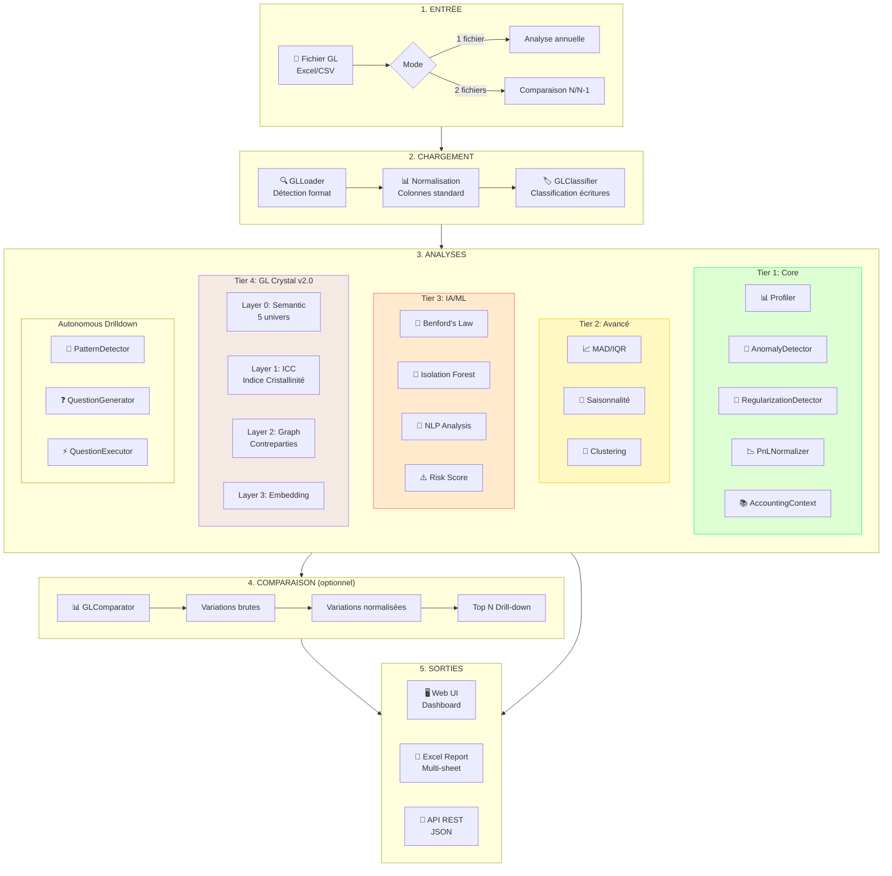
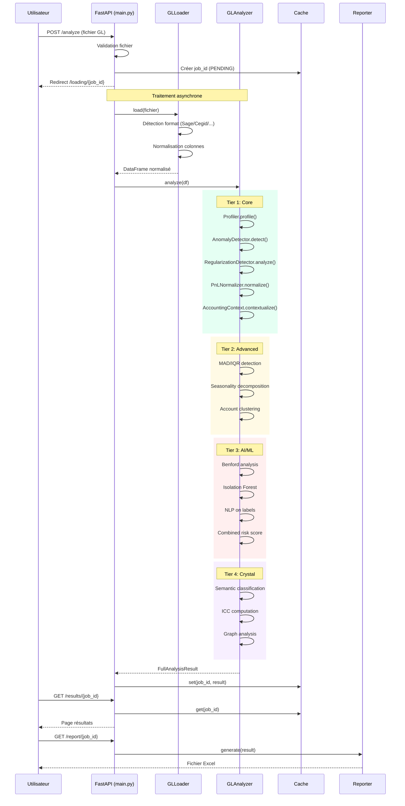
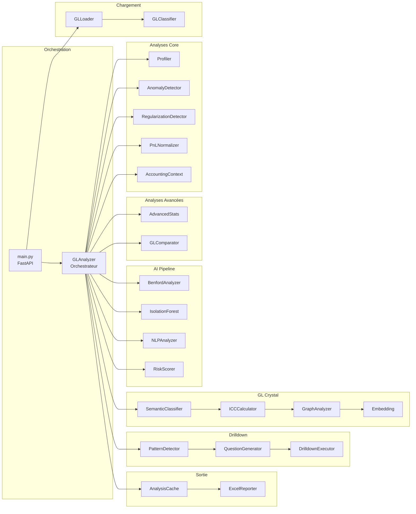

# ExamineMyData - Processus de bout en bout

## Vue d'ensemble

ExamineMyData est une application d'analyse de Grand Livre (GL) qui transforme des données comptables brutes en insights opérationnels via un pipeline multi-couches.

## Diagramme de flux principal



## Séquence détaillée



## Architecture des modules



## Détail des analyses

### Tier 1: Core (toujours exécuté)

| Module | Fonction | Sortie |
|--------|----------|--------|
| **Profiler** | Statistiques de base, qualité données | DataProfileResult |
| **AnomalyDetector** | Concentrations, montants ronds | DetectionResult |
| **RegularizationDetector** | Provisions (68x) / Reprises (78x) | RegularizationAnalysis |
| **PnLNormalizer** | Run rate = Total/12, écart décembre | RunRateResult |
| **AccountingContext** | Classification PCG, comportement attendu | ContextualizedAnomaly |

### Tier 2: Avancé (conditionnel)

| Module | Fonction | Condition |
|--------|----------|-----------|
| **MAD** | Median Absolute Deviation | Données suffisantes |
| **IQR** | Interquartile Range | Données suffisantes |
| **Seasonality** | Décomposition saisonnière | >= 12 mois |
| **Clustering** | Groupement comportemental | >= 10 comptes |

### Tier 3: IA/ML (optionnel)

| Module | Fonction | Dépendances |
|--------|----------|-------------|
| **Benford** | Loi de Benford (chiffres fabriqués) | numpy |
| **IsolationForest** | Détection anomalies non-supervisée | scikit-learn |
| **NLP** | Analyse des libellés | - |
| **RiskScorer** | Score combiné 0-100 | Tous les précédents |

### Tier 4: GL Crystal v2.0 (topologique)

| Layer | Fonction | Sortie |
|-------|----------|--------|
| **0: Semantic** | Classification en 5 univers | Universe (CRISTALLIN, NOMINATIF, INVENTAIRE, VENTILATION, COMPOSITE) |
| **1: ICC** | Indice de cristallinité (0-1) | ICC score + Surprise metric |
| **2: Graph** | Analyse bipartite contreparties | Graph metrics |
| **3: Embedding** | Représentation vectorielle | Vectors |

## Sorties générées

### Interface Web

- **Upload** (`/`) - Formulaire de téléchargement
- **Loading** (`/loading/{id}`) - Page de chargement avec polling
- **Results** (`/results/{id}`) - Dashboard interactif
- **Report** (`/report/{id}`) - Téléchargement Excel
- **Qualification** (`/qualification/{id}`) - Qualification anomalies

### Rapport Excel (multi-feuilles)

| Feuille | Contenu |
|---------|---------|
| **Synthèse** | Métriques clés, brut vs normalisé |
| **Réconciliation** | Pont de variance |
| **Provisions** | Détail des ajustements par compte |
| **Anomalies** | Liste complète avec contexte PCG |
| **Drill-down** | Top variations (si comparaison) |
| **Notes** | Warnings et recommandations |
| **Données mensuelles** | Breakdown mensuel |
| **Crystal ICC** | Top surprises (si activé) |

### API REST

```
GET  /api/status/{job_id}        → Statut du job
GET  /api/drilldown/{job_id}     → Questions générées
POST /api/drilldown/{job_id}/{q} → Exécuter question
GET  /api/settings/status        → Statut IA
```

## Formules clés

### Run Rate (normalisation)

```
Run Rate mensuel = Total annuel / 12

Écart décembre = Décembre brut - Run Rate

Si Écart > 0 → Sur-provisionnement probable
Si Écart < 0 → Sous-provisionnement probable

Résultat normalisé = Résultat brut - Σ(Écarts décembre)
```

### Indice de Cristallinité (ICC)

```
ICC = f(
    variation_montants,      # Écart-type des montants
    entropie_libellés,       # Diversité des descriptions
    régularité_temporelle,   # Distribution dans le temps
    diversité_journaux,      # Nombre de journaux distincts
    concentration_contreparties  # Concentration sur tiers
)

ICC ∈ [0, 1]
  0 = Amorphe (très variable)
  1 = Cristallin (très régulier)

Surprise = |ICC_observé - ICC_attendu_univers|
```

### Risk Score

```
Risk Score = w1 * Benford_score
           + w2 * IsoForest_score
           + w3 * NLP_score
           + w4 * Concentration_score

Score ∈ [0, 100]
  0-20:   MINIMAL
  20-40:  LOW
  40-60:  MEDIUM
  60-80:  HIGH
  80-100: CRITICAL
```
